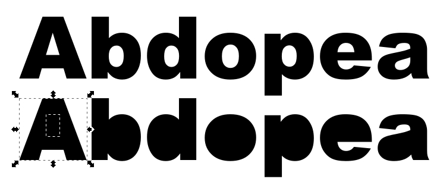

# inkscape break apart font

s there an easy way to separate the letters, It is currently all one object
r/Inkscape - Is there an easy way to separate the letters, It is currently all one object

Use 'Path → Break Apart' to make each sub-path its own object. You'll have to recombine the letters with holes ('a' and 'e') by using 'Path → Combine' with the outer and inner path selected.

inkscape break apart font

