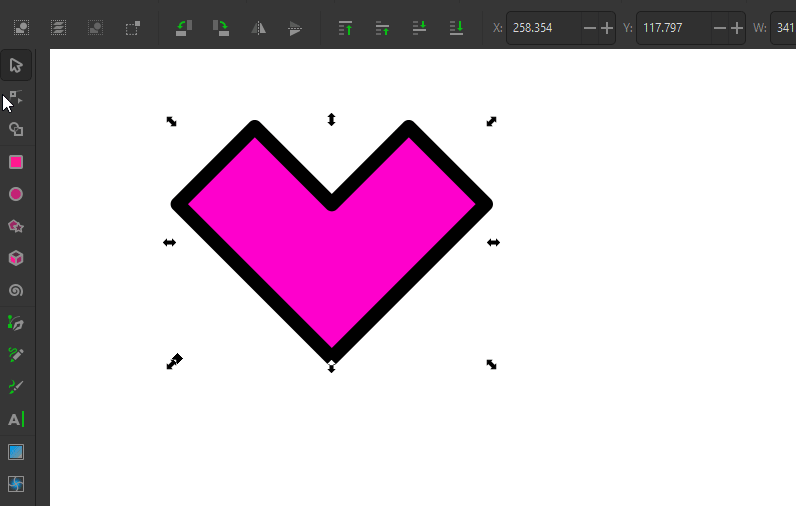

# Inkscape - rounding corners of shapes?

Inkscape 1.3+

Select the object with Node Tool
Click Add Corners button in the toolbar. (Icon of rounded corners + 2 dots)
Click and drag round nodes on your object
You can select multiple nodes and round them all at once

https://superuser.com/questions/640954/inkscape-rounding-corners-of-shapes
