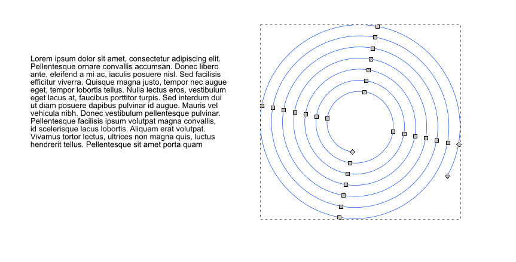
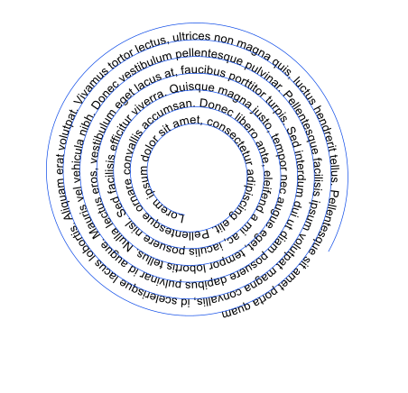

# Putting Text on a Path

The adjustment of letters’ and words’ positions are merely the finishing touch. More often, it is useful to start out by layouting the text as a whole in a drawing. Inkscape offers two options for this, which are accessible via Text ‣ Put on Path and Text ‣ Flow into Frame.

To make a text that follows a path’s curvature, you need to do this:

Create a path that will serve as the base line for the words and letters of the text. The path can be created by using the shape tools and combining shapes with the Boolean operations, or by drawing it directly with one of the tools that draw paths.

Write the text directly on the canvas, after clicking on it with the mouse. It’s not useful to use flowed text in a frame for this.

With the Selector tool, select the path and the text. Then make Inkscape do the work by selecting Text ‣ Put on Path from the menu.

The result will show up on the canvas immediately. The text can still be edited at any time: you can change its contents or style whenever you like. The path will remain editable, too: you can shape its curves, add or delete nodes, move it, etc. and the text will automatically adjust to its changed shape.

Very often, this path only serves to position the text. If you delete it, the text doesn’t have anything to follow anymore, and reverts to its previous shape. If you don’t want to see the path in your drawing, remove its fill and its stroke!

https://inkscape-manuals.readthedocs.io/en/latest/putting-text-on-path.html

---

http://tavmjong.free.fr/INKSCAPE/MANUAL/html/Text-Path.html

Text on a Path
Text can be put along an arbitrary path.

Text on a spiral path.
Text on Spiral paths. On the right, the path has been hidden by turning off the Stroke paint.
To place text on a path, enter the text as a Regular text or Flowed text. Draw the desired path. Select both text and path, then use the Text → icon Put on Path command. The text should now appear along the path. Note that Shapes except for Rectangles are described internally by Inkscape as paths and thus don't require converting to a path.

Both the text and the path can be edited in place. The text should adjust to any changes in the path. The path can be made invisible by selecting only the path, then removing the Stroke paint with the Fill and Stroke dialog. To select an invisible path for editing, select the text and use Edit → Clone → icon Select Original (Shift+D). To remove text from a path, use Text → icon Remove from Path.

Parts of the text can be selected and the style, kerning, and so forth can be adjusted as for regular text. Text can also be moved independently of the path by selecting the text only and using the normal means for moving objects.

Adjusted text.
Text can be adjusted or moved relative to the path. Left: the text has been adjusted and kerned with the Alt+arrow keys. Placing the cursor at the beginning of the text and using the Alt+arrow keys will move the starting position of the text. Right: the text has been moved independently of the path by selecting the text only and dragging it to its new position with the mouse.
Text on a path is initially placed on the “left” side of the path (referenced from the path direction) starting at the beginning of the path. One can change the direction of the text (and the side it is placed on) by reversing the direction of the path (e.g., Path → icon Reverse (Shift+R)). If the text is center justified prior to being put on a path, it will centered along the path.

Text on a circle.
To place text on a circle so that it reads from left to right on both the top and bottom, two circles must be used as seen on the left. The larger circle has been flipped horizontally (Object → Text on a circle. Flip Horizontal (H)) so the text is placed inside the circle starting from the left. The smaller circle has been rotated 180 degrees. (The path of a circle when first drawn starts from the rightmost point. The circle must be rotated or flipped to move the starting point of the path to the left.) By turning the circles into half circles and setting the text to center-justified, the text will automatically be centered at the top or bottom of the circle. Note that kerning may be necessary as the characters of text placed on the outside of a curve will be too far apart while those on the inside of a curve will be too close together.
